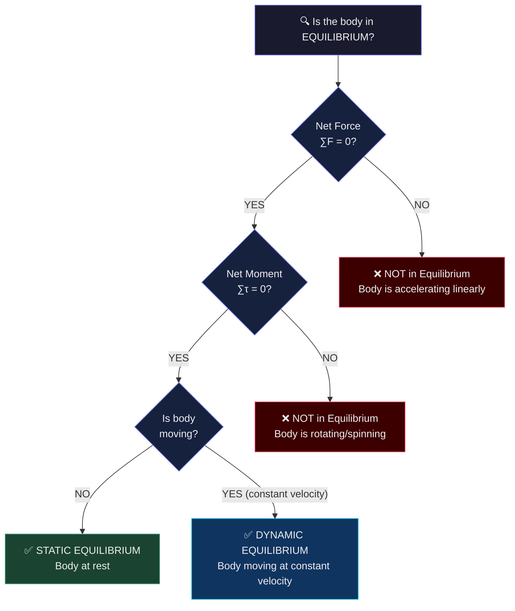

# Chapter 1 · Section 1.4
# Equilibrium of Bodies
### *"A skydiver falling at 200 km/h says she's in equilibrium. A book sitting still says the same. Are they both right?"*

> 🧑‍🏫 **Professor Magnus** | 👧 **Mira** | 🧒 **Arjun** | 🐱 **Newton the Cat**

---

## 🎯 What You Will Learn

By the end of this section, you should be able to:

- Define equilibrium in physics.
- Distinguish between static equilibrium and dynamic equilibrium.
- Explain why zero velocity does not always mean equilibrium.
- State the two conditions for complete equilibrium: $\sum F = 0$ and $\sum \tau = 0$.
- Apply equilibrium ideas to objects at rest and objects moving with constant velocity.

---

## 🔮 The Mystery — Falling at Full Speed, Perfectly Balanced

Professor Magnus shows the class a short clip description:

> *A skydiver jumps from a plane. For the first 10 seconds, she accelerates — faster and faster. Then, something strange happens. Her speed stops increasing. She falls at a perfectly constant 180 km/h for the next 40 seconds — no faster, no slower. She is falling rapidly, yet she is somehow "balanced."*

He pauses.

> **"A book on this desk is balanced — it's not moving at all.**
> **A skydiver falling at 180 km/h is also balanced.**
> **Can something falling at high speed really be called balanced?**
> **What does 'balanced' actually mean in physics?"**

---

### 🧪 Socratic Discussion

**Arjun:** "Balanced means not moving. The book is balanced. The skydiver is not — she's flying through the air at 180 km/h. That's the opposite of balanced."

**Newton the Cat** 😼: "I once fell off a shelf at what felt like terminal velocity. I was NOT balanced. I was panicking."

**Mira:** "But wait — if the skydiver isn't accelerating, doesn't that mean... the forces on her are equal? Gravity pulling down and air resistance pushing up — at exactly 180 km/h those two are equal?"

**Professor Magnus:** "Mira is onto something. Let me sharpen the question. What do you think 'balanced' actually means? Not 'stopped.' Not 'still.' Think more carefully."

**Arjun:** *(slowly)* "...Not changing? Like, the same speed in the same direction — constant?"

**Professor Magnus:** "Now we're close. Let's build the proper definition."

---

## 🎯 Prediction Challenge

Which of the following objects is / are in equilibrium?

- **A)** A book resting on a table (completely still)
- **B)** A car moving at a steady 60 km/h on a straight road
- **C)** A ball thrown upward, at the exact moment it reaches its highest point
- **D)** A raindrop falling at constant terminal velocity

> 🤔 *One answer? Two? All four? Think before reading on.*

---

## 🖼️ Image Prompt 1

```
[IMAGE PROMPT]
Scene: A 4-panel vertical strip, each showing an object in a different state.
PANEL 1 — "Book on table": Book resting still. Downward arrow labeled "Weight W". Upward arrow labeled "Normal Reaction N". Both arrows equal length. Label: "STATIC EQUILIBRIUM — At rest."
PANEL 2 — "Car on road": Car moving right at steady speed. Forward arrow "Engine Force". Backward arrow "Friction/Drag". Equal lengths. Label: "DYNAMIC EQUILIBRIUM — Constant velocity."
PANEL 3 — "Ball at peak": Ball at top of arc. Downward arrow "Gravity". NO upward force. Label: "NOT equilibrium — Velocity is zero but changing direction."
PANEL 4 — "Raindrop": Raindrop falling. Downward "Weight W" arrow = upward "Air Resistance" arrow. Label: "DYNAMIC EQUILIBRIUM — Constant velocity downward."
Characters: Mira pointing at Panel 4 looking satisfied. Arjun staring at Panel 3 looking surprised.
Style: Educational infographic. Clean split panels. Color-coded arrows. 2:3 vertical ratio. Print-friendly.
```

---

## 👁️ Observation

- Panels 1, 2, and 4 show equilibrium. Panel 3 does NOT.
- Equilibrium does NOT require the object to be stationary.
- Equilibrium requires the **net force to be zero** — whether the object is still or moving at constant velocity.
- A ball at its peak has zero velocity — but gravity is still acting and changing its direction. Not equilibrium.

---

## 🧠 Deep Explanation — Feynman Style

### Step 1: What Does "State" Mean?

In physics, the "state" of a body is defined by two things:
1. **Its velocity** (speed + direction)
2. **Its rotational condition** (spinning or not)

A body's "state" changes only when a **net unbalanced force** or a **net unbalanced moment** acts on it.

If neither acts — the body keeps its state forever. This is Newton's First Law expressed in equilibrium language.

---

### Step 2: Static Equilibrium — The Easy Case

**Static equilibrium** = the body is at rest and remains at rest.

All forces cancel: net force = 0. All moments cancel: net moment = 0.

Examples:
- A book on a desk (weight down, normal reaction up — equal)
- A lamp hanging from the ceiling (weight down, tension in wire up — equal)
- A balanced see-saw with no loads

The body is not accelerating linearly. It is not rotating. It simply stays.

---

### Step 3: Dynamic Equilibrium — The Surprising Case

**Dynamic equilibrium** = the body is moving, but moving at **constant velocity** in a **straight line**.

Again: net force = 0, net moment = 0. But this time, the object is not still — it's moving.

**Why is this equilibrium?** Because the body isn't changing its state of motion. Velocity (speed + direction) is constant. No acceleration. No rotation.

Real examples:
- **Raindrop at terminal velocity**: Gravity (down) = Air resistance (up). Net force = 0. Falls at constant speed.
- **Car at constant speed on a straight road**: Engine force = Road friction. Net force = 0. Moves at constant velocity.
- **A hockey puck sliding on a perfectly frictionless surface**: No net force at all. Slides forever at the same speed.

**Mira:** "So dynamic equilibrium isn't a special type — it's the same condition (net force = 0) just applied to a moving body?"

**Professor Magnus:** "Exactly. The physics doesn't care whether you start from rest or from motion. If the net force is zero at any moment, that body is in equilibrium at that moment."

---

### Step 4: Two Conditions — Translation AND Rotation

Here's the crucial point that most students miss:

**A body can be translationally balanced but rotationally unbalanced — or vice versa.**

Consider a see-saw with equal weights equally placed: translationally fine (net vertical force = 0), rotationally fine (net moment = 0). True equilibrium.

Now put both weights on the same side: the seesaw might still have zero net vertical force (it doesn't fly upward), but the moments are violently unbalanced — it tilts and rotates.

**This is why there are TWO conditions for equilibrium:**

| Condition | Equation | Prevents |
|:---|:---:|:---|
| **First Condition** (Translational) | $\sum F = 0$ | Linear acceleration |
| **Second Condition** (Rotational) | $\sum \tau = 0$ | Angular acceleration / rotation |

**Both must be satisfied simultaneously** for a body to be in complete equilibrium.

---

### Step 5: Expanding the Second Condition

$\sum \tau = 0$ means: the sum of all clockwise moments = the sum of all anticlockwise moments.

$$\sum \tau_{CW} = \sum \tau_{ACW}$$

Or equivalently, if we assign + to ACW and − to CW:

$$\sum \tau_{net} = 0$$

This is the rotational equilibrium condition, and it forms the basis of the **Principle of Moments** (Section 1.5).

---



---

## 🔍 Critical Thinking Corner

| Scenario | In Equilibrium? | Why? |
|:---|:---:|:---|
| A ball thrown straight up, moving upward | ❌ | Gravity acts downward — net force ≠ 0, velocity changing |
| A ball at the very top of its path | ❌ | Velocity = 0, but gravity still acts — will change state |
| A satellite in circular orbit | ❌ (for translational) | Direction of velocity constantly changes — net force ≠ 0 (gravity acting) |
| A book tilted on a desk at 10°, not sliding | ❌ (close call) | Normal force + friction + weight — check if net moment = 0 |
| A raindrop at terminal velocity | ✅ | $W = F_{air}$, net force = 0, constant velocity |
| A beam balanced perfectly on a pivot | ✅ | $\sum F = 0$, $\sum \tau = 0$ — both conditions met |

> **Hidden assumption:** We often assume "not moving = equilibrium." The ball at its peak destroys this assumption. Equilibrium is about **forces**, not just about velocity being zero.

---

## 📘 Formal Conclusion — ICSE Board Ready

### ✅ Equilibrium (Definition)

> A body is said to be in **equilibrium** if it does not change its state of rest or of uniform motion in a straight line.

---

### ✅ Kinds of Equilibrium

#### (1) Static Equilibrium

> A body is in **static equilibrium** when it is **at rest** and the net force and net torque acting on it are both zero.

*Examples:* A book on a table. A balanced metre rule. A lamp hanging from a ceiling.

#### (2) Dynamic Equilibrium

> A body is in **dynamic equilibrium** when it is moving with **constant velocity** (constant speed in a straight line) and the net force and net torque acting on it are both zero.

*Examples:* A raindrop at terminal velocity. A car at constant speed on a straight road. A parachutist descending at constant speed.

---

### ✅ Conditions for Equilibrium

**First Condition (Translational Equilibrium):**

$$\boxed{\sum \vec{F} = 0}$$

> The vector sum of all forces acting on the body must be zero.

**Second Condition (Rotational Equilibrium):**

$$\boxed{\sum \tau = 0}$$

> The algebraic sum of all moments (torques) about any point must be zero.
> Equivalently: $\sum \tau_{ACW} = \sum \tau_{CW}$

---

### ✅ ICSE Key Table

| Feature | Static Equilibrium | Dynamic Equilibrium |
|:---|:---:|:---:|
| Body at rest? | ✅ Yes | ❌ No |
| Constant velocity? | ✅ (velocity = 0) | ✅ (velocity ≠ 0, but constant) |
| Net force = 0? | ✅ | ✅ |
| Net moment = 0? | ✅ | ✅ |
| Acceleration? | ❌ None | ❌ None |
| Example | Book on table | Raindrop at terminal velocity |

---

## ⚠️ Newton Cat's Exam Traps

> 🐱 *Newton the Cat fell off the shelf and thinks he experienced non-equilibrium. He's right about that, but wrong about four other things.*

**Trap 1 — "Equilibrium always means the body is stationary"**
> ❌ **WRONG.** Dynamic equilibrium means moving at constant velocity. A body can be in equilibrium while moving at 200 km/h.

**Trap 2 — "Zero velocity = equilibrium"**
> ❌ **WRONG.** A ball at the top of its trajectory has zero velocity, but gravity still acts on it — creating a net force. Its velocity is about to change direction. **Not equilibrium.**

**Trap 3 — "If net force = 0, the body is in full equilibrium"**
> ❌ **INCOMPLETE.** Net force = 0 only satisfies the *first* condition. You must also verify net moment = 0 (the *second* condition). A body with zero net force can still rotate if moments are unbalanced.

**Trap 4 — "A satellite in circular orbit is in equilibrium"**
> ❌ **WRONG.** The satellite's direction of velocity constantly changes — it is always accelerating toward Earth (centripetal). Net force ≠ 0. It is NOT in equilibrium.

**Trap 5 — "Static and dynamic equilibrium are different types of physics"**
> ❌ **WRONG.** Both require exactly the same two conditions: $\sum F = 0$ and $\sum \tau = 0$. The only difference is whether the velocity is zero or non-zero (but constant).

---

## 🧩 Mini Challenge

### 🧠 Conceptual
> A tightrope walker stands perfectly still on the rope.
> **(a)** What type of equilibrium is this?
> **(b)** List all the forces acting on the tightrope walker and state why the net force equals zero.
> **(c)** Why must the net moment also be zero for her to remain upright?
> **(d)** If she suddenly leans 10° to the left, what changes in terms of equilibrium conditions?

### 🔢 Numerical
> A uniform metre rule (mass 100 g) is balanced at the 40 cm mark. A 200 g weight hangs from the 10 cm mark.
> **(a)** Is the system in translational equilibrium? (Consider forces in the vertical direction.)
> **(b)** Calculate the moment of the 200 g weight about the pivot at 40 cm.
> **(c)** For rotational equilibrium, what force must act at the 70 cm mark?
> **(d)** Include the weight of the ruler. Where does the ruler's weight effectively act?

### 🌍 Application
> A cyclist rides at a constant 15 km/h on a flat road. The engine provides 80 N of forward force.
> **(a)** What is the magnitude of all resistive forces (friction + air drag)?
> **(b)** Is the cyclist in static or dynamic equilibrium?
> **(c)** The cyclist suddenly stops pedalling. Are they still in equilibrium? What happens next?
> **(d)** Eventually the cyclist slows to 0 km/h and stops. What type of equilibrium are they in now?

---

*→ In **Section 1.5**, we transform the second condition of equilibrium ($\sum \tau = 0$) into a practical, powerful tool — the **Principle of Moments** — and learn how to solve see-saw problems with precision.*

---
