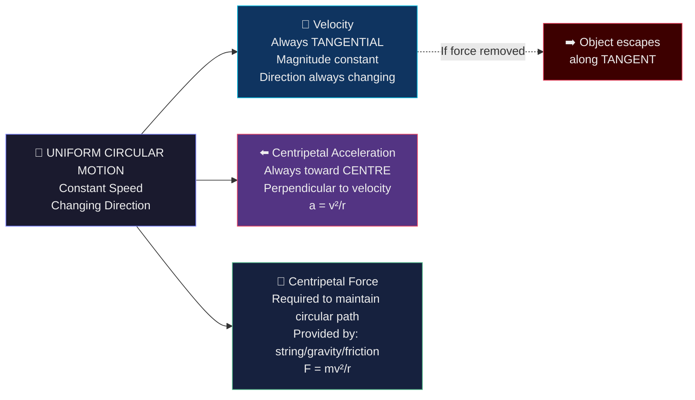

# Chapter 1 · Section 1.7
# Uniform Circular Motion
### *"You're driving at a perfectly steady 60 km/h around a roundabout. Your speedometer doesn't move. Yet physics says you are accelerating. Your physics teacher is either lying — or 'speed' and 'velocity' are not the same thing."*

> 🧑‍🏫 **Professor Magnus** | 👧 **Mira** | 🧒 **Arjun** | 🐱 **Newton the Cat**

---

## 🎯 What You Will Learn

By the end of this section, you should be able to:

- Define uniform circular motion.
- Explain why constant speed in a circle still means acceleration.
- Distinguish between speed and velocity.
- State the direction of velocity and centripetal acceleration at any point.
- Use $a_c = \frac{v^2}{r}$ in simple numerical problems.

---

## 🔮 The Mystery — Accelerating Without Speeding Up

Professor Magnus puts a ball on a string. He begins swinging it in a horizontal circle above his head, at what appears to be a constant speed.

> **"Watch this carefully. I will swing this ball in a perfect circle at a perfectly constant speed.**
> **Question: Is the ball accelerating?"**

**Arjun** answers immediately: "No. Acceleration means speeding up or slowing down. The speed is constant. No acceleration."

**Professor Magnus:** "The speedometer of a car going around a roundabout at steady 60 km/h does not move. The driver says: 'I'm not accelerating.' Yet a physicist watching from outside says: 'You are absolutely accelerating.' Who is right?"

He lets the ball go. It flies off — in a straight line, not a curve.

> **"Where did it go? Straight. Not in the circle. Why?"**

---

### 🧪 Socratic Discussion

**Mira:** "It went straight because when you released it, there was no longer a force pulling it inward. It just... continued in the direction it was already going."

**Arjun:** "But if it goes straight after release — that means *while* it was going in a circle, something was preventing it from going straight. Something was pulling it inward constantly."

**Professor Magnus:** "And if something is constantly pulling you away from a straight line — are you accelerating?"

**Arjun:** *(slowly)* "...I guess yes. But the speed is still constant. That doesn't make sense. Acceleration means speed change."

**Newton the Cat** 😼: "I once ran in a circle for 5 minutes chasing my tail at constant speed. I was very tired. Physics should count that as acceleration."

**Professor Magnus:** "Newton is correct. Let's find out why."

---

## 🎯 Prediction Challenge

A stone is swung in a horizontal circle at constant speed. At the moment the string breaks, the stone:

- **A)** Continues moving in a circle (its "memory" keeps it curving)
- **B)** Moves outward in a straight line, away from the centre
- **C)** Moves along the tangent at the point of release — forward, not outward
- **D)** Slows down immediately and falls straight down

> 🤔 *This answer reveals something fundamental about velocity.*

---

## 🖼️ Image Prompt 1

```
[IMAGE PROMPT]
Scene: Top-down view of a stone being swung in a horizontal circle.
MAIN CIRCLE: Stone shown at 4 positions (N, E, S, W on the circle). At each position, a velocity arrow (blue) drawn as a TANGENT to the circle — pointing forward, not outward and not inward.
At position E: String breaks. Stone leaves along the TANGENT line (straight east-northeast). Label: "Stone travels along the TANGENT — not outward, not along the arc."
STRING shown as a thin line from centre to stone, with label "Tension T provides inward force."
Inward red arrow at each position pointing toward centre. Label: "Centripetal direction — always toward centre."
CALLOUT: "Velocity is ALWAYS tangential. Acceleration is ALWAYS centripetal (inward). They are PERPENDICULAR to each other."
Characters: Mira drawing tangent lines with a ruler. Arjun looking surprised by the tangent direction.
Style: Clean top-down physics diagram. Blue for velocity, red for acceleration. Precise angles. 2:3 vertical ratio. Print-friendly.
```

---

## 👁️ Observation

- Velocity arrows at every point are **tangent** to the circle — not pointing inward or outward.
- The stone flies off along the **tangent** (not outward) when released.
- The **centripetal (inward)** direction is **perpendicular** to the velocity at every instant.
- Even though speed is constant, velocity (direction + speed) is continuously changing.

---

## 🧠 Deep Explanation — Feynman Style

### Step 1: Speed vs Velocity — The Critical Distinction

**Speed** is a scalar: it tells you *how fast* — just a number. 60 km/h.

**Velocity** is a vector: it tells you *how fast* AND *in what direction*. 60 km/h **northward**.

Now here's the crucial physics:

**Acceleration** = rate of change of **velocity** (not speed).

If velocity changes — even if only the *direction* changes while the magnitude stays the same — there IS acceleration.

In circular motion, the direction changes *continuously*. Every instant, the stone at position A has a different direction of velocity than at position B.

$$\text{Change in velocity} = \vec{v}_B - \vec{v}_A \neq 0 \text{ (because directions differ)}$$

Therefore: **acceleration exists**, even though the speed is constant.

---

### Step 2: Direction of Velocity in Circular Motion

At any instant, the velocity of the stone in circular motion points along the **tangent** to the circle at that point.

**Why the tangent?**

Think about a car going around a curved road. At any instant, the car is heading in the direction it's *currently* pointing — not toward the centre, not away from it. This "heading direction" at any point on a curve is the tangent.

**The mud-flap proof:** When a bicycle tyre spins, mud flies off tangentially — straight outward from wherever it was attached, in the direction the surface was moving at that instant. That is the tangent.

**Mira:** "So if the stone is at the top of the circle (moving east), and the string breaks, it keeps going east — not outward (south), not along the arc?"

**Professor Magnus:** "Exactly. It goes along the tangent at the point of release. Option C in our prediction."

---

### Step 3: Why Is Direction Always Changing?

The stone is in a circle. After a small time $\delta t$, it has moved slightly along the arc. Its new position has a new tangent direction — slightly different from before.

Even though the *amount* of velocity (speed) is the same, the *arrow* (direction) has rotated by a small angle.

This rotation of the velocity arrow is the acceleration of circular motion. And the direction of this acceleration — as you can prove geometrically — always points **toward the centre** of the circle.

This centre-directed acceleration has a name: **centripetal acceleration**.

---

### Step 4: Uniform Circular Motion vs Uniform Linear Motion

**Arjun:** "How is this different from just driving in a straight line at constant speed?"

Let's compare carefully:

| Feature | Uniform Linear Motion | Uniform Circular Motion |
|:---|:---:|:---:|
| Speed | Constant | Constant |
| Velocity | Constant (magnitude + direction) | Changing (direction changes) |
| Acceleration | **Zero** | **Non-zero** (centripetal — toward centre) |
| Force required | **Zero** (no net force needed) | **Non-zero** (centripetal force required) |
| Path | Straight line | Circle |
| Energy change | None | None (speed constant) |
| Newton's Law? | 1st Law: No force → no change | 2nd Law: Net force → centripetal acceleration |

**The key insight:** Linear motion at constant speed requires **zero net force**. Circular motion at constant speed requires a **continuous non-zero net force** directed toward the centre.

---

### Step 5: Why Does the Ball Need a String?

Without the string, the ball would go straight — tangentially. Newton's first law: an object continues in a straight line unless a net force acts.

The string pulls the ball *inward* — preventing it from going straight, constantly redirecting it.

Remove the string → the inward force disappears → ball goes straight (tangent).

**This is the fundamental physics of circular motion: the circular path is maintained by a continuous inward force. Without it, the object escapes along a tangent.**

---



---

## 🔍 Critical Thinking Corner

| Scenario | What Happens? |
|:---|:---|
| String breaks while stone moves in a circle | Stone flies off along the tangent at that point |
| Speed of stone in circle increases | Still UCM? No — if speed changes, it's not *uniform* circular motion |
| Stone moves in a circle at constant speed but smaller radius | Centripetal acceleration increases ($a = v^2/r$) |
| A satellite at constant speed in circular orbit — is it accelerating? | ✅ Yes — gravity is the centripetal force, continuously redirecting velocity |
| A car on a banked curve at constant speed — any acceleration? | ✅ Yes — centripetal. The banking provides the inward force component |

> **Hidden assumption broken:** "Acceleration = speeding up." Physics definition: acceleration = **any change in velocity**, including direction change. Circular motion at constant speed is perpetually accelerated.

---

## 📘 Formal Conclusion — ICSE Board Ready

### ✅ Uniform Circular Motion (Definition)

> **Uniform circular motion** is the motion of a body moving along a circular path with **constant speed**.

- The *speed* is constant.
- The *velocity* is NOT constant — its direction changes continuously.
- The body is continuously *accelerating* (changing velocity direction) even though speed is unchanged.

---

### ✅ Direction of Velocity in UCM

> At any instant during uniform circular motion, the velocity of the body is directed along the **tangent** to the circular path at that point.

- The velocity is always **perpendicular** to the radius at that point.
- When the force (string/gravity) is removed, the body flies off along this tangent.

---

### ✅ Difference Between UCM and Uniform Linear Motion

| Feature | Uniform Linear Motion | Uniform Circular Motion |
|:---|:---:|:---:|
| Speed | Constant | Constant |
| Velocity | **Constant** (no change) | **Variable** (direction changes) |
| Acceleration | **Zero** | **Non-zero** (centripetal) |
| Net Force | **Zero** | **Non-zero** (centripetal force) |
| Path | Straight line | Circle |
| Newton's Law | First Law | Second Law |

---

### ✅ Centripetal Acceleration (ICSE Formula)

$$a_c = \frac{v^2}{r}$$

Where:
- $a_c$ = centripetal acceleration [m/s²]
- $v$ = speed of the object [m/s]
- $r$ = radius of the circular path [m]

Direction: always toward the **centre** of the circle.

---

## ⚠️ Newton Cat's Exam Traps

> 🐱 *Newton the Cat chased his tail in a circle for 5 minutes. He now has opinions about acceleration.*

**Trap 1 — "Constant speed = no acceleration"**
> ❌ **WRONG.** Acceleration = rate of change of *velocity*. Velocity includes direction. In UCM, direction changes continuously, so centripetal acceleration is present even at constant speed. Its **magnitude** is constant for a fixed speed and radius, but its **direction** keeps changing so that it always points toward the centre.

**Trap 2 — "When the string breaks, the stone flies outward"**
> ❌ **WRONG.** When the string breaks, the stone flies along the **tangent** at the point of release — not directly outward (radially). This is one of the most common mistakes in ICSE.

**Trap 3 — "Centripetal acceleration points outward (away from centre)"**
> ❌ **WRONG.** Centripetal means "centre-seeking." The acceleration points **inward, toward the centre**. Always.

**Trap 4 — "UCM is the same as uniform linear motion — both have constant speed"**
> ❌ **WRONG.** They are fundamentally different. Linear motion: zero net force, constant velocity (direction unchanged). UCM: non-zero centripetal force, constantly changing velocity direction.

**Trap 5 — "A satellite in orbit is weightless because gravity is absent"**
> ❌ **WRONG.** Gravity is present and acts as the centripetal force. The satellite (and astronaut inside) are in **free fall** — falling toward Earth while moving fast enough horizontally to keep missing it. Apparent weightlessness ≠ absence of gravity.

---

## 🧩 Mini Challenge

### 🧠 Conceptual
> A stone is whirled in a horizontal circle on a string of length 0.5 m at constant speed.
> **(a)** At any instant, in which direction is the stone's velocity?
> **(b)** In which direction is the stone's acceleration?
> **(c)** At the instant the string breaks, describe the subsequent path of the stone.
> **(d)** Is the stone in equilibrium while moving in the circle? Justify.

### 🔢 Numerical
> A ball moves in a circular path of radius 2 m at a constant speed of 6 m/s.
> **(a)** Calculate the centripetal acceleration of the ball.
> **(b)** If the ball's mass is 0.5 kg, calculate the centripetal force acting on it.
> **(c)** If the speed doubles (to 12 m/s) but radius remains 2 m, what is the new centripetal force?
> **(d)** If speed stays at 6 m/s but radius halves (to 1 m), what is the new centripetal force?

### 🌍 Application
> A cyclist is riding around a circular track of radius 50 m at a constant speed of 10 m/s.
> **(a)** Is the cyclist in equilibrium? Explain.
> **(b)** What is the centripetal acceleration?
> **(c)** What provides the centripetal force for the cyclist?
> **(d)** If the road is wet (low friction), what happens to the cyclist's circular path? Use the concept of centripetal force to explain.

---

*→ In **Section 1.8**, we will name the force that keeps objects in circular motion — Centripetal Force — and unravel the mystery of why you feel pushed outward in a turning car even though physics says there is no outward force.*

---
