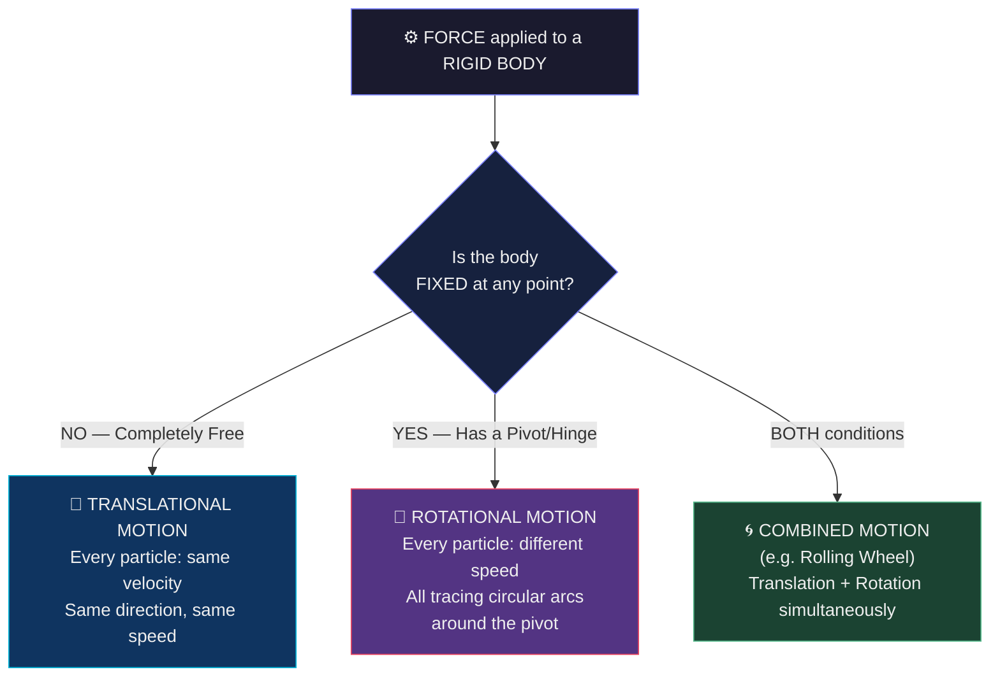

# Chapter 1 · Section 1.1
# Translational and Rotational Motion
### *"Why does a door turn when a ball just flies away?"*

> **Characters in this episode:**
> 🧑‍🏫 **Professor Magnus** — The mentor who never gives the answer first.
> 👧 **Mira** — The one who notices what others don't.
> 🧒 **Arjun** — The practical thinker who trusts common sense.
> 🐱 **Newton the Cat** — Overconfident. Occasionally wrong. Always dramatic.

---

## 🎯 What You Will Learn

By the end of this section, you should be able to:

- Distinguish between translational motion and rotational motion.
- Explain why a door rotates about a hinge while a free object may translate.
- Identify the role of a pivot, axis of rotation, and rigid body.
- Recognise examples of pure translation, pure rotation, and combined motion.

---

## 🔮 The Mystery — Before We Begin, Something Strange Happens

It's Monday morning. Professor Magnus walks into the lab and says nothing.

He picks up a **cricket ball** from his desk, places it on the floor, and gives it a firm kick.

The ball rolls across the room. Everyone watches.

Then he walks to the **lab door**, places both hands on its surface, and pushes.

The door swings open with a slow, heavy creak.

He turns around and asks just one question:

---

> **"I applied force in both cases. The ball moved. The door moved.**
> **But they moved *completely differently*.**
> **Why?"**

---

He sits down. He says nothing more.

The room is quiet.

---

### 🧪 Socratic Discussion — Round 1: Collecting Predictions

**Arjun** leans forward first. He trusts his gut.

> **Arjun:** "It's obvious, isn't it? The door is heavier. A heavier object is harder to push straight, so it turns instead. Simple."

**Mira** frowns slightly.

> **Mira:** "But wait — if that were true, then if you put a *really heavy ball* on the floor and kicked it... would it turn instead of roll? That doesn't feel right."

**Newton the Cat** (who has been sitting on the windowsill) stretches dramatically.

> **Newton:** 😼 "Clearly the door turns because Professor Magnus pushed it in a *circular* direction. He *curved* his push. Obviously."

**Professor Magnus** raises an eyebrow.

> **Professor Magnus:** "Interesting theories. Let me ask something simpler first. Before we talk about *why*... can anyone tell me — **what is actually different** about these two situations? Not why. Just what you *observe* as different."

---

**Mira** thinks carefully.

> **Mira:** "The ball... moved *as a whole*. Every part of it went together to the other side of the room."

**Arjun:** "And the door... didn't really *go* anywhere. It stayed attached at one side. But the other side swung."

**Professor Magnus** smiles for the first time.

> **Professor Magnus:** "Now we're looking at the right thing."

---

## 🎯 Prediction Challenge — Stop Here

Before reading further, think about this:

**A door has a hinge on one side. A cricket ball has no hinge, no attachment, nothing.**

When force is applied to each —

**Which statement is most accurate?**

- **A)** The ball moves differently because it is rounder than the door.
- **B)** The door turns because the force was applied in a curved direction.
- **C)** The key difference is that the door is *fixed at one point*, while the ball is *completely free*.
- **D)** Both motions are the same kind — force always causes straight-line movement.

> 🤔 *Pause. Pick your answer. Hold it in your mind.*
> *We will return to it.*

---

---

## 👁️ Observation — What Do You Notice?

Look carefully at the image above.

- In the left panel: **every blue arrow is the same length and same direction.** The ball is not spinning. It is simply *traveling*.
- In the right panel: **the blue arrows are all different lengths.** The outer edge of the door sweeps the most. The hinge sweeps zero.
- The **hinge** is the key. It is the only point that does not move.

This is the entire secret of this section.

---

## 🧠 Deep Explanation — Feynman Style

### Step 1: What does "motion" actually mean for a big object?

When a physicist says an object "moves," they must be careful. An object like a door or a cricket bat is not a single point — it's made of *millions of atoms*, all connected together.

So when we say "the object moved," we need to ask: **did all the atoms move the same way, or differently?**

This question — *how do the particles of a rigid body move relative to each other* — is the core of what we're exploring.

> *A rigid body is an object that never changes its shape or size when force is applied.*
> *Think: a steel ruler, a wooden plank, a metal door. Not a sponge, not a balloon.*

We study rigid bodies because their math is clean — no squishing, no deforming. Every atom is locked in its relationship with every other atom. When one atom moves, they all move together.

Now: *how* do they move together?

---

### Step 2: The Sliding Object — Translational Motion

Imagine you push a book that's lying flat on a frictionless icy table.

If you push it **from the centre**, every atom in the book moves forward together. Atom at the front moves 10 cm. Atom at the back moves 10 cm. Atom on the left moves 10 cm.

Every atom travels the **same distance**, in the **same direction**, at the **same time**.

This kind of motion has a name: **Translational Motion**.

**The fingerprint of translational motion:**
Every particle of the body has the same velocity — same speed, same direction — at any given instant.

This is also called **linear motion** in simpler cases, but translational is more precise — it includes both straight-line and curved paths, as long as *every part of the object shares the same motion*.

---

### Step 3: The Turning Object — Rotational Motion

Now go back to the door.

The hinge is fixed to the wall. The door cannot "go away" — it can only *rotate* around the hinge.

When you push the far edge of the door, what happens to each atom?

- **Atom near the hinge:** Travels along a tiny little arc. Barely moves.
- **Atom in the middle:** Travels along a medium arc.
- **Atom at the far edge:** Travels a *huge* arc — the full swing.

Every atom traces a **circle** around the hinge. But the circles are different sizes depending on how far the atom is from the hinge.

**The fingerprint of rotational motion:**
Every particle of the body traces a circular arc around a fixed point (the pivot). Particles at different distances from the pivot trace arcs of different radii.

The fixed point — the hinge, the axle, the pin — is called the **pivot** or the **axis of rotation**.

---

### Step 4: The Hidden Assumption — What Makes This Possible?

Here's the secret that most textbooks skip:

**A fixed point is one common way to make rotation obvious.**

If the door had no hinge and you pushed it, it would *slide* like the book.
If the ball had a nail through its centre pinned to the ground, it would *spin* like a top.

**In these ICSE examples, the constraint — the fixed point — is what converts a "push" into a "turn."**

But keep the deeper physics clear: a body does not always need a fixed pivot to rotate. A free rigid body can rotate if a force acts away from its centre of mass, or if a couple acts on it. The fixed hinge simply makes the turning effect easy to see and easy to calculate.

This is so important it's worth repeating:

> **Force through centre of mass + Free body → Mainly translational motion**
> **Off-centre force or couple → Rotation may also occur**
> **Force + Fixed pivot → Rotation about the pivot**

The force doesn't "know" to create rotation. What matters is the line of action of the force and the constraints on the body. In a door, the hinge prevents translation and makes the door rotate about the hinge.

---

### Step 5: Can Something Do Both?

**Mira:** "What about a rolling wheel? It rolls *forward* (translation) but also *spins* (rotation). What is that?"

**Professor Magnus:** "Excellent catch, Mira. A rolling wheel is doing *both simultaneously*. The centre of the wheel is translating — moving forward in a straight line. But every point on the rim is also rotating about the centre. This is called **rolling motion**, and it's a combination."

**Arjun:** "So translation and rotation aren't opposites? They can happen at the same time?"

**Professor Magnus:** "Exactly. Think of a bowled cricket ball that also spins — it translates across the pitch while rotating. When we study ICSE problems, we separate them to understand each one clearly. But nature mixes them freely."

---

---

## 🔍 Critical Thinking Corner

**What changes if...**

| Scenario | Question | Think About It |
|:---|:---|:---|
| The hinge is removed from the door | Does the door still rotate when pushed? | If pushed through its centre, a free door mostly slides. If pushed off-centre, it can slide and rotate together. |
| You push the door exactly through the hinge | Does the door rotate? | The "turning" effect drops to zero. The force has nowhere to pivot from. |
| You push a ball that's resting against a wall | Does the wall act like a pivot? | Not quite — the ball can still slide. A true pivot must *constrain* the body. |
| The cricket ball has a pin through its exact center nailed to the ground | What happens when you kick it? | It rotates in place — becomes a spinning top. Same ball, different constraint. |

> **Hidden assumption:** We always assume the body is *rigid*. If the object can deform — bend, stretch, squish — then neither rule applies cleanly. Rigid body mechanics is a *simplification* that makes the math tractable.

---

## 📘 Formal Conclusion — ICSE Board Ready

### ✅ Rigid Body (Definition)

> A **rigid body** is a body which does not undergo any change in its shape or size under the action of an external force.

*In reality, all bodies deform slightly. But for ICSE problems, we treat them as perfectly rigid.*

---

### ✅ Translational Motion (Definition)

> **Translational motion** is the motion in which every particle of the body undergoes the same displacement — the same magnitude and direction — in a given interval of time.

- The body may move in a straight line (**linear translation**) or along a curved path (**curvilinear translation**).
- Key signature: **all particles share identical velocity at every instant.**

*Examples:* A book sliding on a desk. A car moving on a straight road. A stone thrown horizontally (each bit of the stone has the same velocity).

---

### ✅ Rotational Motion (Definition)

> **Rotational motion** is the motion in which every particle of the body moves along a circular arc, all arcs having their centres on a common line called the **axis of rotation** (or about a common **pivot point**).

- Key signature: **different particles have different speeds**, but all complete one revolution in the same time.
- The particle farthest from the axis has the greatest speed.

*Examples:* A door opening/closing. A wheel spinning on its axle. The hands of a clock. A top spinning on its point.

---

### ✅ Important ICSE Points

| Feature | Translational | Rotational |
|:---|:---|:---|
| All particles same velocity? | ✅ Yes | ❌ No |
| Path traced by each particle | Same (parallel) | Circles of different radii |
| Requires a fixed pivot? | ❌ No | Not always; ICSE door examples use a pivot, but free bodies can also rotate |
| Example | Sliding book | Spinning door |
| Force causes | Displacement of body | Turning effect |

---

## ⚠️ Newton Cat's Exam Traps

> 🐱 **Newton the Cat bursts through the door dramatically...**

**Trap 1 — "Rotation always needs more force"**

> ❌ **WRONG.** Rotational motion depends on *where* the force is applied, not just *how much*. A tiny force applied far from the pivot can create more turning than a huge force at the pivot.

**Trap 2 — "Translation = straight line, always"**

> ❌ **NOT ALWAYS.** Translation means "all particles share the same velocity." A satellite in a perfectly circular orbit is technically in *curvilinear translational motion* if treated as a point mass. Don't assume translation = only horizontal sliding.

**Trap 3 — "A spinning cricket ball is purely rotational"**

> ❌ **WRONG.** A spinning ball travelling across a pitch is doing *both* simultaneously. It is in **combined motion**. ICSE examiners love asking about this — always check if there is *both* a forward movement *and* a spin.

**Trap 4 — "The pivot always stays still because it is heavier"**

> ❌ **WRONG.** The pivot is fixed because it is *constrained* — held by a wall, pin, hinge, or bearing. Weight has nothing to do with it. The hinge on a door is lighter than the door itself, yet the door rotates around the hinge.

---

## 🧩 Mini Challenge

### 🧠 Conceptual

> A spinning top is placed on a smooth floor. It spins about its tip AND slowly drifts across the floor.
>
> Is this translational, rotational, or combined motion? Justify your answer.

---

### 🔢 Numerical

> A rigid rod of length 2 m is pinned at one end (pivot). The other end moves through an arc.
>
> **(a)** What kind of motion does the rod undergo?
> **(b)** If the free end travels 10 cm in one second, what is the speed of the midpoint of the rod at the same instant?

*(Hint: Think about arc lengths. Particles at different distances from pivot sweep different arcs in the same time.)*

---

### 🌍 Application

> A construction worker needs to open a large, heavy vault door. The door is hinged on its left side.
>
> He tries pushing near the hinge — the door barely moves.
> He tries pushing near the far edge — the door swings open easily.
>
> He has not changed the force he applies.
>
> **(a)** What type of motion is the door undergoing?
> **(b)** Why did the door open easily when pushed at the far edge?
> **(c)** What does this tell you about the relationship between a force's *position* and its *turning effect*?

*(This question bridges into Section 1.2 — you are building the foundation right now.)*

---

> 🐱 **Newton the Cat:** "Wait — if I push the door right through the hinge, it won't open AND it won't slide? So I'm achieving nothing? This is a personal attack."
>
> **Professor Magnus:** "Welcome to physics, Newton. Force without leverage is effort without result."

---

*→ In **Section 1.2**, we will finally give this "turning effect" a name, a formula, and a precise way to measure it. The idea you've been building toward has an identity — it's called the **Moment of Force**.*

---
