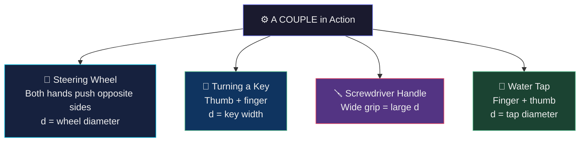

# Chapter 1 · Section 1.3
# Couple
### *"Two hands. Same door. One stays still. One swings wide. Why does splitting your push work better than combining it?"*

> 🧑‍🏫 **Professor Magnus** | 👧 **Mira** | 🧒 **Arjun** | 🐱 **Newton the Cat**

---

## 🎯 What You Will Learn

By the end of this section, you should be able to:

- Define a couple as two equal and opposite parallel forces on different lines of action.
- Explain why a couple produces rotation without translation.
- Calculate the moment of a couple using $F \times d$.
- Understand why the moment of a couple is independent of the reference point.
- Avoid confusing a couple with an action-reaction pair.

---

## 🔮 The Mystery — The Bottle Cap Rebellion

Professor Magnus places a water bottle on the desk. He looks at Arjun.

> **"Open it."**

Arjun twists the cap off easily. Two seconds. Magnus closes it back.

> **"Now open it — using only one finger. No thumb. One finger only."**

Arjun pushes with his index finger at the rim of the cap. The bottle slides. The cap doesn't turn. He tries harder. More sliding. Cap still stuck.

> **Professor Magnus:** "The first time you used thumb on one side, finger on the other — opposite sides, opposite directions. That opened it in seconds. One finger alone won't do it no matter how hard you push. Why?"

---

### 🧪 Socratic Discussion

**Arjun:** "It's friction. Two fingers create more grip on the cap."

**Mira:** "But pressing harder with one finger also increases friction. Yet the cap still doesn't open."

**Newton the Cat** 😼: "The thumb and finger form a *superior alliance*. The cap respects two-finger authority."

**Professor Magnus:** "Newton has accidentally said something useful. When you use both thumb and finger — where exactly is each one pushing?"

**Mira** *(thinking)*: "...Opposite sides of the cap. They push in *opposite directions*."

**Arjun:** "But if they push in opposite directions, shouldn't they cancel? The cap shouldn't move at all."

**Professor Magnus** *(smiling)*: "Why does it move then?"

---

## 🎯 Prediction Challenge

A cap is acted on by **two equal forces of 5 N each**, opposite directions, one on each side.

- **A)** Nothing happens — equal and opposite forces cancel completely.
- **B)** The cap slides in one direction.
- **C)** The cap doesn't slide, but it *rotates* — it spins in place.
- **D)** The cap both slides AND rotates simultaneously.

> 🤔 *Commit to an answer. This is the central mystery of the section.*

---

## 🖼️ Image 1

---

## 👁️ Observation

- One force: cap slides AND barely rotates — messy, inefficient.
- Two opposite forces (couple): cap rotates cleanly in place. Zero sliding.
- The bottle doesn't even move when a couple is applied.
- A couple creates **pure rotation** with **zero net translational effect**.

---

## 🧠 Deep Explanation — Feynman Style

### Step 1: Why Don't They Cancel?

Equal and opposite forces cancel only when they act along the **same line of action**. When the thumb and finger act at different points — on opposite sides of the cap — their lines of action are **parallel but separate**.

Because of this separation, both forces attempt to rotate the cap in the **same direction** — they cooperate perfectly:

- Thumb on left, pushing right → spins cap **clockwise**
- Finger on right, pushing left → also spins cap **clockwise**

They add their turning effects together, not cancel them.

---

### Step 2: The Zero Net Force Trick

$$F_{net} = 5\text{ N (right)} + 5\text{ N (left)} = 0$$

Net force is zero → cap's centre of mass doesn't translate. It doesn't slide.

But the cap **rotates**.

This is the elegant core of a couple: **zero net force, non-zero turning effect**. Pure rotation without translation.

---

### Step 3: Calculating the Moment

With no single fixed pivot, the moment of a couple is calculated as:

$$\boxed{\tau_{couple} = F \times d}$$

Where $F$ = either force (both are equal) and $d$ = perpendicular distance between the two forces (couple arm).

**Arjun:** "But I'm applying two forces of 5 N each — why isn't the moment $5 \times d + 5 \times d = 10d$? I'm putting in twice the effort!"

**Professor Magnus:** "Pick any reference point — say the centre. Force 1 is $d/2$ away, Force 2 is $d/2$ away. Both clockwise."

$$\text{Total} = F \times \frac{d}{2} + F \times \frac{d}{2} = F \times d$$

**Mira:** "So $d$ already accounts for both. Using $2F \times d$ would double-count."

---

### Step 4: The Independence Property

> **The moment of a couple is the same about any point in its plane.**

Whether you calculate from the left force's position, the right's, or any random point between — you always get $F \times d$.

A single force's moment changes depending on the pivot. A couple's moment is **an intrinsic fixed property** of the force pair — independent of reference point.

---

### Step 5: Couples in Daily Life

**Pattern:** Every example deliberately maximises $d$ — wider grip, larger wheel, fatter handle — to get more torque with the same force.

---

## 🔍 Critical Thinking Corner

| Scenario | Effect |
|:---|:---|
| Double force on one side only? | No longer a couple — creates translation + rotation |
| Forces along the same line? | Cancel completely — zero net force AND zero moment |
| Couple arm $d$ doubled? | Moment doubles with same forces |
| Couple applied to a free body? | Rotates about its own centre of mass — no translation |
| Can a single force balance a couple? | ❌ No — a single force always produces translation |

---

## 📘 Formal Conclusion — ICSE Board Ready

### ✅ Couple (Definition)

> A **couple** consists of two equal, parallel forces acting in **opposite directions** with **different lines of action** (separated by a perpendicular distance).

**Three conditions:**
1. Forces equal in magnitude
2. Forces parallel
3. Forces opposite in direction along **different** lines of action

---

### ✅ Moment of a Couple

$$\boxed{\tau_{couple} = F \times d}$$

- $F$ = magnitude of either force [N]
- $d$ = perpendicular distance between the two forces — the **couple arm** [m]
- $\tau$ = moment of couple [N·m]

---

### ✅ Key Properties

| Property | Detail |
|:---|:---|
| Net force | **Zero** |
| Net moment | **Non-zero** ($F \times d$) |
| Motion produced | **Pure rotation only** |
| Moment about any point | **Same** — reference-independent |
| Balanced by | Only another couple of equal and opposite moment |

---

### ✅ Common ICSE Examples

| Application | Couple Arm |
|:---|:---|
| Water tap | Diameter of knob |
| Steering wheel | Diameter of wheel |
| Screwdriver | Width of handle |
| Key in lock | Width of key grip |
| Winding a watch | Diameter of crown |

---

## ⚠️ Newton Cat's Exam Traps

> 🐱 *Newton the Cat has been opening bottle caps all morning. He has found five ways to be wrong.*

**Trap 1 — "Equal and opposite forces always cancel to zero"**
> ❌ Only if along the *same line*. Different parallel lines → rotational effects **add up**.

**Trap 2 — "Moment of couple = $2F \times d$"**
> ❌ It is $F \times d$. The couple arm $d$ is the *full* separation. Using $2F \times d$ double-counts.

**Trap 3 — "A couple can be balanced by a single large force"**
> ❌ A couple has zero net force. A single force always has a translational component. Only another couple can balance a couple.

**Trap 4 — "Moment of couple changes based on the pivot point chosen"**
> ❌ The moment of a couple is the **same about any point** in its plane.

**Trap 5 — "More force is always the solution for stubborn caps"**
> ❌ What matters is $F \times d$. Increase $d$ (wider grip) to get more torque without more force.

---

> 🐱 **Newton the Cat:** "The secret to opening stubborn caps is geometry, not strength?"
> **Mira:** "Maximise $d$."
> **Newton the Cat** *(staring at jam jar)*: "...I need a bigger hand."

---

## 🧩 Mini Challenge

### 🧠 Conceptual
> Two forces of 8 N each act as a couple on a wheel of diameter 40 cm.
> **(a)** What is the couple arm? **(b)** Calculate the moment. **(c)** What motion is produced?

### 🔢 Numerical
> A steering wheel of diameter 35 cm has forces of 12 N applied as a couple.
> **(a)** Calculate the moment. **(b)** If force increases to 20 N, what is the new moment? **(c)** At 12 N but diameter 50 cm, what is the moment?

### 🌍 Application
> A surgeon uses an instrument with grip diameter 1.2 cm. Maximum comfortable force: 3 N.
> **(a)** Maximum moment of couple? **(b)** Screw requires 0.06 N·m — can the surgeon turn it? **(c)** New instrument with 2.5 cm grip — what is the new moment?

---

*→ In **Section 1.4**, we examine what happens when all forces and couples on a body are perfectly balanced — and what the body does as a result.*

---
